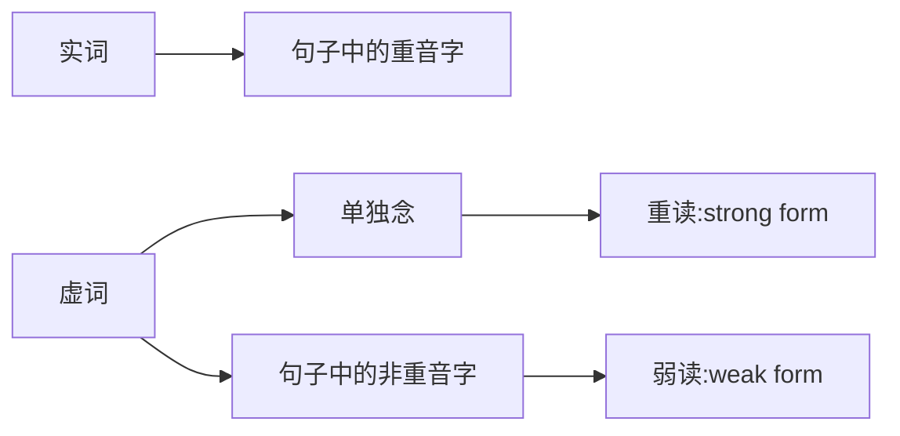

# 1.英文听力问题

1. 语速太快或连音听不懂
2. 听不出其实已经学会的字
3. 内容太长，找不到重点
4. 遇到不熟悉的口音时听不懂

# 2.学习方法

## Bottom-up Approach（由下至上的学习方法）

Intensive Listening（精听），即听出每个单字、片语、句子等**声音组合**。

学习目标：
- 系统化地了解英文的口语发音。
- 微观认识英文的发音特色：连音、省音、重音、缩读、弱读等。
- 了解发音规则后，做短句听写练习。

## Top-down Approach（由上至下的学习方法）
   
Extensive Listening（泛听），即听懂段落内容。

学习目标：
- 不需听到每个字也可以推理出段落大意。
- 有策略的理解段落内容。
- 练习英文听力日记：
  - Pre-listening（听力前）：熟悉主题，预测相关字词，回想背景知识。
  - Listening（听力中）：配合题、问答题、是非题、选择题。
  - Post-listening（听力后）：回忆学到的用法、知识和使用过的听力策略。
   
## 认识世界英语

学习目标：系统化的认识世界各地的口音特色。
- 常见口音：英国、澳洲、印度
- 欧洲口音：法国、德国、西班牙
- 亚洲口音：新加坡、越南、泰国、日本、韩国

# 3.单字重音

英文有**重音**，形成**节奏**。句子加长，时间不一定也加长。

一个单字中有一个或多个音节，拍手几次就是几个音节。

单字重音**音调较高、时间拖长、且音量越大**。

| 重音音节标示 | 单字 |
| --- | --- |
| ● 。 | empty, argue, bathroom, crowded, lovely |
| 。● 。 | ambitious, attractive, opinion, invited, gigantic |
| 。。● | disagree, impolite, introduce, recommend, unemployed |
| 。。● 。 | politician, education, energetic, photographic, invitation |

训练单字重音：[Word Stress Exercise](https://www.wordstress.info/exercise/)

# 4.句子重音

实词代表句子的核心意义，是句子当中的重音字，念起来**重、慢、长**。

虚词没有实质意义，但有文法功能，是句子当中的非重音字，念起来**轻、快、短**。

句子重音构成了英文的**节奏感**，不过重音程度与位置也因人而异。

一个句子当中，有些字是重音，有些是非重音，句子重音的特色与单字重音相似：1）**音调较高** 2）**时间拖长** 3）**音量较大**。

| | 重音字Stressed Words/实词/内容字Content Words |
| --- | --- |
| 名词 | Jason、Seattle、bus |
| 动词 | play、draw、tell、break |
| 形容词 | big、tasty、happy、red |
| 副词 | quickly、loudly、well |

| | 非重音字Unstressed Words/虚词/功能字Function Words |
| --- | --- |
| 助动词 | do、should、can、may |
| Be动词 | is、am、are、was、were |
| 介系词 | in、on、at、to、for、of、with |
| 代名词 | I、you、we、they、she、he |
| 连接词 | and、or、but、since、so |
| 冠词 | a、an、the |
|  | 注：虚词的否定型，如can‘t、doesn't、shouldn't、wasn't等，在句子中念作**重音**。 |

示例
- He **wanted** to **play** **chess**.
- My **letter** was **lost** in the **mail**.

# 5.虚词弱读

## 虚词弱读

| - | 单独念：重读 (strong form) | 句子中：弱读 (weak form) |
| :---: | :---: | :---: |
| Of | /ɑv/ | /ə/ |
| To | /tu/ | /tə/ |
| For | /fɔr/ | /fɚ/ | 

示例训练：
- Get him out **of** here.
- That's not going **to** happen.
- This is **for** you.

## 最常见的母音：央元音
**[ə]**

央元音，英文叫 Schwa sound 写起來像是倒過來的 e ，念起來像中文里轻轻念「呃」的声音。

## And /ænd/ /ən/

| 重读 (strong form) | 弱读 (weak form) |
| :---: | :---: |
| /ænd/ | /ən/ |

示例训练：
- People come **and** go so quickly here.（这里人來人往也太快了）
- Slow **and** steady wins the race.（稳定脚踏实地的人，终将胜出）
- It’s apples **and** oranges.（兩者完全不同，无法比較）

## Or /ɔr/ /ər/

| 重读 (strong form) | 弱读 (weak form) |
| :---: | :---: |
| /ɔr/ | /ər/ |

示例训练：
- Take it **or** leave it.
- Whether you like it **or** not.（不管你喜不喜欢，就是这样了）
- It’s going to happen sooner **or** later.

## For /fɔr/ /fər/

| 重读 (strong form) | 弱读 (weak form) |
| :---: | :---: |
| /fɔr/ | /fər/ |

示例训练：
- I think it’s **for** the best. （這已经是最好的选择了）
- Just **for** the record. （我强调一下）
- Good **for** you. （真棒啊）

## Of /ɑv/ /əv/ /ə/

| 重读 (strong form) | 弱读 (weak form) |
| :---: | :---: |
| /ɑv/ | /əv/ /ə/ |

#### 如果 of 后面接「子音」，经常省略只剩下 /ə/：
- a lot of food （很多食物）
- a piece of cake （一块蛋糕）
- a bottle of water （一瓶水）
- the cost of living （生活費）
- Game of Thrones （权力游戏）

#### 如果 of 后面接「母音，或是 /ju/」，會念作 /əv/，方便与后面的母音连音
- all of us （所有人）
- United States of America （美國）
- First day of August （八月第一天）
- a lot of information （很多咨询）
- a box of eggs （一盒蛋）

示例训练：
- Get him out **of** here. （让他走开）
- Speaking **of** which… （说到這個 ...）
- It’s one **of** a kind. （独一无二，无可取代）

## To /tu/ /tə/

| 重读 (strong form) | 弱读 (weak form) |
| :---: | :---: |
| /tu/ | /tə/ |

示例训练：
- I want **to** talk face **to** face. （我要面对面谈）
- Get back **to** work. （回去工作吧）
- You’re such a down-**to**-earth guy. （你真是个老实的人）

# 6.搞懂总是听不清的缩写

## n't

n't 是 not 的缩写，通常 /t/ 不送气，但是气流会阻断，可以用前后文以及停顿来判断有没有 n't 的缩写。

示例训练：
- I mean it **doesn’t** make sense. （这沒道理呀）
- I really **couldn't** care less. （我真的不在乎）
- It **wasn't** a big deal. （这沒什么，是件小事）
- I **wouldn't** miss it for the world. （我绝对不可能错过）
- You **shouldn't** have. （你不用这样，太客气了）

## 'd

'd 的缩写可能是 would，had 以及 did，没有听出来可以用前后文以及文法来判断。

示例训练：
- **Who'd** you vote for this time?（你这次 (会) 投给谁？who'd 可以是 who would 或 who did 的缩写）
- She thought **it'd** be fun.（她想说会很好玩。 it’d 是 it would 的缩写）
- **Who'd** you bring?（你带了谁？或是你会帶谁？ who’d 是 who did 或是 who would 的缩写）
- If **he'd** stayed on the plane, **he'd** be dead.（如果他当初有在飞机上，他就会死。he'd 前后分別是 he had 以及 he would 的缩写）
- I was afraid **I'd** say something **I'd** regret.（我害怕我会说出我后悔的话。两个 I'd 都是 I would 的缩写）
- **Who'd** like to jump in? Anyone?（有谁想要参加的吗？有人吗？ who'd 是 who would 的缩写）
- **You'd** better come in.（你最好给我进来。you'd 是 you had 的缩写）
- **Why'd** you bring me here?（你为何把我带来这里？ why'd 是 why did 的缩写）

## 've

've 是 have 的缩写，可以念成 /əv/ 或 /ə/，最常见的是 could've，should've 以及 would've。听力上 've 常常很轻带过，也可以用前后文与文法推敲。

| 最常见的've缩写 | 完整写法 |发音规则 |
| :---: | :---: | :---: |
| could've | could have |coulda /ə/ |
| should've | should have |shoulda /ə/ |
| would've | would have |woulda /ə/ |
| couldn't've | could not have | couldav /əv/ |
| shouldn't've | should not have |shouldav /əv/ |
| wouldn't've | would not have |wouldav /əv/ |

示例训练：
- I **would’ve** said yes. （我原本会说好的 /əv/）
- Something **could’ve** happened. （当时本来可能会出事 /ə/）
- **What’ve** you got? （你有什么本事？）
- Well, guess I **should’ve** known better. （我应该要更识相才对）
- **Couldn’t** have done it without you. （沒有你的话，我沒办法成功）
- **Should’ve** listened to him. （我当初应该要听他的）
- I **shouldn’t** have done it. （我当初不应该这样做的 shouldn't've）
- I **should've** brought my laptop. I **could've** gotten so much work done.
（我应该要带我的笔记本电脑來的，我本来可以完成很多事）
- Who **would've** thought it? （谁当初会想到呢？）
