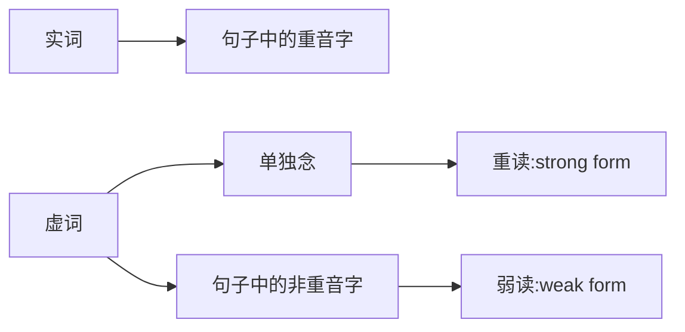

# 1.英文听力问题

1. 语速太快或连音听不懂
2. 听不出其实已经学会的字
3. 内容太长，找不到重点
4. 遇到不熟悉的口音时听不懂

# 2.学习方法

## Bottom-up Approach（由下至上的学习方法）

Intensive Listening（精听），即听出每个单字、片语、句子等**声音组合**。

学习目标：
- 系统化地了解英文的口语发音。
- 微观认识英文的发音特色：连音、省音、重音、缩读、弱读等。
- 了解发音规则后，做短句听写练习。

## Top-down Approach（由上至下的学习方法）
   
Extensive Listening（泛听），即听懂段落内容。

学习目标：
- 不需听到每个字也可以推理出段落大意。
- 有策略的理解段落内容。
- 练习英文听力日记：
  - Pre-listening（听力前）：熟悉主题，预测相关字词，回想背景知识。
  - Listening（听力中）：配合题、问答题、是非题、选择题。
  - Post-listening（听力后）：回忆学到的用法、知识和使用过的听力策略。
   
## 认识世界英语

学习目标：系统化的认识世界各地的口音特色。
- 常见口音：英国、澳洲、印度
- 欧洲口音：法国、德国、西班牙
- 亚洲口音：新加坡、越南、泰国、日本、韩国

# 3.单字重音

英文有**重音**，形成**节奏**。句子加长，时间不一定也加长。

一个单字中有一个或多个音节，拍手几次就是几个音节。

单字重音**音调较高、时间拖长、且音量越大**。

| 重音音节标示 | 单字 |
| --- | --- |
| ● 。 | empty, argue, bathroom, crowded, lovely |
| 。● 。 | ambitious, attractive, opinion, invited, gigantic |
| 。。● | disagree, impolite, introduce, recommend, unemployed |
| 。。● 。 | politician, education, energetic, photographic, invitation |

训练单字重音：[Word Stress Exercise](https://www.wordstress.info/exercise/)

# 4.句子重音

实词代表句子的核心意义，是句子当中的重音字，念起来**重、慢、长**。

虚词没有实质意义，但有文法功能，是句子当中的非重音字，念起来**轻、快、短**。

句子重音构成了英文的**节奏感**，不过重音程度与位置也因人而异。

一个句子当中，有些字是重音，有些是非重音，句子重音的特色与单字重音相似：1）**音调较高** 2）**时间拖长** 3）**音量较大**。

| | 重音字Stressed Words/实词/内容字Content Words |
| --- | --- |
| 名词 | Jason、Seattle、bus |
| 动词 | play、draw、tell、break |
| 形容词 | big、tasty、happy、red |
| 副词 | quickly、loudly、well |

| | 非重音字Unstressed Words/虚词/功能字Function Words |
| --- | --- |
| 助动词 | do、should、can、may |
| Be动词 | is、am、are、was、were |
| 介系词 | in、on、at、to、for、of、with |
| 代名词 | I、you、we、they、she、he |
| 连接词 | and、or、but、since、so |
| 冠词 | a、an、the |
|  | 注：虚词的否定型，如can‘t、doesn't、shouldn't、wasn't等，在句子中念作**重音**。 |

示例
- He **wanted** to **play** **chess**.
- My **letter** was **lost** in the **mail**.

# 5.虚词弱读

## 虚词弱读

| - | 单独念：重读 (strong form) | 句子中：弱读 (weak form) |
| :---: | :---: | :---: |
| Of | /ɑv/ | /ə/ |
| To | /tu/ | /tə/ |
| For | /fɔr/ | /fɚ/ | 

示例训练：
- Get him out **of** here.
- That's not going **to** happen.
- This is **for** you.

## 最常见的母音：央元音
**[ə]**

央元音，英文叫 Schwa sound 写起來像是倒過來的 e ，念起來像中文里轻轻念「呃」的声音。

## And /ænd/ /ən/

| 重读 (strong form) | 弱读 (weak form) |
| :---: | :---: |
| /ænd/ | /ən/ |

示例训练：
- People come **and** go so quickly here.（这里人來人往也太快了）
- Slow **and** steady wins the race.（稳定脚踏实地的人，终将胜出）
- It’s apples **and** oranges.（兩者完全不同，无法比較）

## Or /ɔr/ /ər/

| 重读 (strong form) | 弱读 (weak form) |
| :---: | :---: |
| /ɔr/ | /ər/ |

示例训练：
- Take it **or** leave it.
- Whether you like it **or** not.（不管你喜不喜欢，就是这样了）
- It’s going to happen sooner **or** later.

## For /fɔr/ /fər/

| 重读 (strong form) | 弱读 (weak form) |
| :---: | :---: |
| /fɔr/ | /fər/ |

示例训练：
- I think it’s **for** the best. （這已经是最好的选择了）
- Just **for** the record. （我强调一下）
- Good **for** you. （真棒啊）

## Of /ɑv/ /əv/ /ə/

| 重读 (strong form) | 弱读 (weak form) |
| :---: | :---: |
| /ɑv/ | /əv/ /ə/ |

#### 如果 of 后面接「子音」，经常省略只剩下 /ə/：
- a lot of food （很多食物）
- a piece of cake （一块蛋糕）
- a bottle of water （一瓶水）
- the cost of living （生活費）
- Game of Thrones （权力游戏）

#### 如果 of 后面接「母音，或是 /ju/」，會念作 /əv/，方便与后面的母音连音
- all of us （所有人）
- United States of America （美國）
- First day of August （八月第一天）
- a lot of information （很多咨询）
- a box of eggs （一盒蛋）

示例训练：
- Get him out **of** here. （让他走开）
- Speaking **of** which… （说到這個 ...）
- It’s one **of** a kind. （独一无二，无可取代）

## To /tu/ /tə/

| 重读 (strong form) | 弱读 (weak form) |
| :---: | :---: |
| /tu/ | /tə/ |

示例训练：
- I want **to** talk face **to** face. （我要面对面谈）
- Get back **to** work. （回去工作吧）
- You’re such a down-**to**-earth guy. （你真是个老实的人）

# 6.搞懂总是听不清的缩写

## n't

n't 是 not 的缩写，通常 /t/ 不送气，但是气流会阻断，可以用前后文以及停顿来判断有没有 n't 的缩写。

示例训练：
- I mean it **doesn’t** make sense. （这沒道理呀）
- I really **couldn't** care less. （我真的不在乎）
- It **wasn't** a big deal. （这沒什么，是件小事）
- I **wouldn't** miss it for the world. （我绝对不可能错过）
- You **shouldn't** have. （你不用这样，太客气了）

## 'd

'd 的缩写可能是 would，had 以及 did，没有听出来可以用前后文以及文法来判断。

示例训练：
- **Who'd** you vote for this time?（你这次 (会) 投给谁？who'd 可以是 who would 或 who did 的缩写）
- She thought **it'd** be fun.（她想说会很好玩。 it’d 是 it would 的缩写）
- **Who'd** you bring?（你带了谁？或是你会帶谁？ who’d 是 who did 或是 who would 的缩写）
- If **he'd** stayed on the plane, **he'd** be dead.（如果他当初有在飞机上，他就会死。he'd 前后分別是 he had 以及 he would 的缩写）
- I was afraid **I'd** say something **I'd** regret.（我害怕我会说出我后悔的话。两个 I'd 都是 I would 的缩写）
- **Who'd** like to jump in? Anyone?（有谁想要参加的吗？有人吗？ who'd 是 who would 的缩写）
- **You'd** better come in.（你最好给我进来。you'd 是 you had 的缩写）
- **Why'd** you bring me here?（你为何把我带来这里？ why'd 是 why did 的缩写）

## 've

've 是 have 的缩写，可以念成 /əv/ 或 /ə/，最常见的是 could've，should've 以及 would've。听力上 've 常常很轻带过，也可以用前后文与文法推敲。

| 最常见的've缩写 | 完整写法 |发音规则 |
| :---: | :---: | :---: |
| could've | could have |coulda /ə/ |
| should've | should have |shoulda /ə/ |
| would've | would have |woulda /ə/ |
| couldn't've | could not have | couldav /əv/ |
| shouldn't've | should not have |shouldav /əv/ |
| wouldn't've | would not have |wouldav /əv/ |

示例训练：
- I **would’ve** said yes. （我原本会说好的 /əv/）
- Something **could’ve** happened. （当时本来可能会出事 /ə/）
- **What’ve** you got? （你有什么本事？）
- Well, guess I **should’ve** known better. （我应该要更识相才对）
- **Couldn’t** have done it without you. （沒有你的话，我沒办法成功）
- **Should’ve** listened to him. （我当初应该要听他的）
- I **shouldn’t** have done it. （我当初不应该这样做的 shouldn't've）
- I **should've** brought my laptop. I **could've** gotten so much work done.
（我应该要带我的笔记本电脑來的，我本来可以完成很多事）
- Who **would've** thought it? （谁当初会想到呢？）

## can 与 can't

### Can 的读音

| 重读 (strong form) | 弱读 (weak form) |
| :---: | :---: |
| /kæn/ 蝴蝶音/æ/，嘴角往两边拉开 | /kən/ 母音变成央元音，轻轻的 “ㄜ” |

一般来说，虚词单独念作重读，在句子里作弱读；但當 Can 在「句尾」时，也会重读。
比如说：**Yes, I can.** **I know that she can.** 
但发音与重音位置在真实的会话中，仍会因每個人说话的习惯不一样而有变化。

示例训练：
- How **can** you be sure? （你怎么能确定？）
- Don't bite off more than you **can** chew. （不要自不量力）
- **Can** I tell you something I’ve never told anyone else?（我能跟你说一件我从来沒跟別人说过的事吗？）

### Can’t 的读音

Can’t 读作 /kænt/，而不是 /kantə/，最后的 /t/ 后面不会再加一個央元音。
Can’t 在句子中常读 /kænʔ/，can’t 的 /t/ 是常常听不到的，很像 /t/ 的声音阻断
在喉咙沒有发出來，这叫做「喉塞音」。

示例训练：
- I **can’t** take it. （我无法忍受了）
- I **can’t** thank you enough. （太感谢你了）
- I **can’t** help it. （我忍不住）

### 如何分辨 Can 以及 Can’t

分辨句子中是 Can 还是 Can’t 主要有 3 大判断点：
1. 时间长：Can 声音比较拖長（一拍，一声），Can’t 声音比较短促（半拍，四声）。
2. 母音：Can 可能母音变成央元音 /kən/ ，但是 Can’t 的母音都是蝴蝶音 /kænt/。
3. 重音：Can’t 通常是句子的重音，但 Can 通常是非重音。

综合以上， can 以及 can’t 最主要的分辨关键其实是「**重音**」。

示例训练：
- I **can’t** take my eyes off him. （我的视线无法离开他。难点：off-im）
- **Can** I have a word with you? （可以跟你借一步说话吗？）
- I **can't** believe how much I love her. I mean, I **can't** get enough of her.（我不敢相信我有多爱她，我实在是太爱她了。难点：of-er）
- You **can't** always get what you want. （你无法总是得到你想要的。）
- As far as I **can** tell, he's exactly the same. （据我所知，他还是一样。）
- I probably **can't** say that, can I? （我估计没法讲那个，对吧？）
- I’m pretty sure she **can** figure it out. （我非常确定她可以自己处理的。）
- I **can't** stand it. Nobody **can** stand it. （我无法接受，沒有人能接受。）
- Women. **Can't** live with them. **Can't** live without them.（女人啊，无法忍受他们，又不能沒有他们。）
- I just **can't** bear to see you doing this to yourself.（我不忍心看你这样对待自己。）

# 7.找出英文听力中不见的声音（1） - 喉塞音

## 喉塞音

喉塞音（Glottal Stop）又叫「吞音」，音标像是一個问号的上半部 /ʔ/。Can’t 在句子中， 通常听不到 /t/，是因为 /t/ 变成了喉塞音。
喉塞音的念法，是先作出要念 /t/ 的舌头与嘴形位，但是不释放气流，气好像在喉咙被阻断一样，变成 /kænʔ/，在句子里面听起來就像是停顿半拍。

喉塞音（吞音），是将声音阻塞在喉咙，在句子里面听起来就像是停顿半拍。

## 喉塞音出现的时机

单字字尾是塞音 /p/, /t/ , /k/ , /b/ , /d/ , /g/ ,且后面接子音时，就会出现喉塞音，也就是气流会阻塞在喉咙，不会释放，听起来像是字尾不见了。

示例训练：
- And **right** now, we need to do something.（现在我们必须做点什么。）
- Mary, **cut** the **crap**. **What** really **happened** with **Brett**?（Mary，废话少说，到底跟 Brett 什么了什么事？）
- Come on, **dad**. Don't make a **big** deal out of it.（爸，別这样，不要小题大作。）
- I am **glad** you've come to **think** more highly of cousin Matthew.（我很欣慰你对你表哥 Matthew 更有信心了。）
- Something came **up** today.（今天突然有急事。）

## 有无喉塞音的对比

| 左边 | 右边 |
| :--- | :--- |
| goal digger | **gold** digger |
| in a **loop** | in a loo |
| I just want to **note**. | I just want to know. |
| It’s my **treat**. | It’s my tree. |
| Did you **keep** my car? | Did you key my car? |
| Let’s make a **plant**. | Let’s make a plan. |

## 单字字尾是塞音，但后面接的是母音时，就会产生连音。

| /p/, /t/ , /k/ , /b/ , /d/ , /g/后面接子音，念喉塞音 | /p/, /t/ , /k/ , /b/ , /d/ , /g/后面接母音，产生连音 |
| :--- | :--- |
| **peanut** butter | peanu**t a**nd jam |
| **black** car | blac**k e**ye |
| **keep** calm | kee**p i**n mind |

# 8.找出英文听力中不见的声音（2） — H, -ing

## H 的发音

非重音字在句子中如果是 “h” 开头，/h/ 往往都不会发音，并且会跟前面一个字连音，这个现象叫做 “**h-dropping**”，也就是 “h”掉了的意思。

例如：him、her、he、here，作为非重音字时，往往都不发 /h/ 的声音。

示例训练：
| 原句 | 解释 | 连音 |
| :--- | :--- | :--- |
|Get **him** out of here. 叫他出去。|him省略/h/ ，跟前面的get连音|get-im|
|Have you seen **her**? 你见过她了吗？|her省略/h/ ，跟前面的seen連音|seen-er|
|Give **her** a chance. 給她个机会。|her省略/h/ ，跟前面的give連音|give-er|
|What did **he** do? 他做了什么？|he省略/h/ ，跟前面的did連音|did-e|
|Get back **here**. 给我滚回來。 |here省略/h/ ，跟前面的back連音|back-er|
|I'll talk to **her**. 我来跟她说。|her省略/h/ ，跟前面的to連音|to-er|

## -ing 的发音

英文说得快的时候，-ing 当中 /ɪŋ/ 的发音其实不会这么清楚，反而会接近/ɪn/、/ən/，失去了最后的鼻音，这个现象叫做 “**g-dropping**”。

例如：
| 原句 | -ing发音 |
| :--- | :--- |
|I heard someone **singing** at midnight.|singin'|
|I was **walking** down the street.|walkin'|
|He was **driving** my car.|drivin'|
|**Something** went wrong.|somethin'或some'n|
|**Nothing** is wrong.|nothin'或no'n|
|It’s **getting** worse.|gettin'或get'n|
|He was **going** home after work.|goin'|
|例外：I’m **gonna**(=going to) leave soon.|gonna|

示例训练：
- Y'all want **something** to drink? （你们要喝点什麼吗？）
- I got **something** **coming** up. **Something** kind of big.（我有件大事要发生了，一件蛮大的事。）
- You need to be **working**, not **walking**.（你应该要工作的，不是在那边走路。）
- It’s **getting** worse. （事情越来越糟了。）
- What are you doing? - I'm **coming** with you.（你在干嘛？-我要跟你去）
- We're **getting** pretty serious. （我們越来越认真要交往了。）

H 以及 G 在这些情况中，发音与否，并无对错，主要还是看说话者的习惯，练习听力时，要练习习惯不一样的发音方式。

# 9.破解听力罩门：连音

## 子音连母音

### 前子音、后母音相连

当前一个字的字尾是**子音发音**，后面一个字的字首是**母音发音**，就会产生连音，多出了一个感觉**本来不存在**的声音。

示例训练：
| 原句 | 释义 | 连音 |
| :--- | :--- | :--- |
| That **came out** wrong. | 我说错话了。| came-out /maʊt/|
| Don’t **give up**. | 别放弃。 | give-up /vʌp/|
| **Keep it** safe. | 保险起见。| keep-it /pɪt/|
| You **had it** coming. | 你自找的。| had-it |
| I **have a** lot going on today, too. | 我今天也发生很多事情。| have-a |
| **I’m on** board. | 我加入。| m-on |
| I **messed up**. | 我搞砸了。| d-up /dʌp/|
| That **explains it**. | 原来如此。| s-it /zit/|
| I don’t want to **step on** your toes. | 我不想冒犯你。| step-on /pon/|

### 连音时的 “t”

如果字尾的子音是 /t/，下一字字首又是母音开头，/t/ 就会跟后面母音产生连音，而且变成一个接近是 **/d/** 的声音，这在英文里面叫作「**弹舌音**」，也有人叫它「弱化的 t 」，这是北美口音重要的发音特色。

示例训练：
| 原句 | 释义 | 连音 |
| :--- | :--- | :--- |
| Wa**t**er | - | /d/ |
| Harry Po**tt**er | - | /d/ |
| It doesn’t ma**tt**er. | - | /d/ |
| Knock **it off**.  | 不要闹了。 | /d/ |
| That’s **what I** thought. | 我想也是。| /d/ |
| I'll make **it up** to you.| 我会补偿你的。| /d/ |

### 连音时的 “y”

◆ 字尾 “t” 后面接「y」，会念作 「ch」( /tʃ/ )
◆ 字尾 “d” 后面接「y」，会念作 「j」( /dʒ/ )
- I want nobody **but you**. → ch ( /tʃ/ )
- She **said you’re** coming. → j ( /dʒ/ )
- I came back **last year**. → ch ( /tʃ/ )
- I already **told you**. → j ( /dʒ/ )

示例训练：
| 原句 | 释义 | 连音 |
| :--- | :--- | :--- |
| I am **glad you** asked. | 我很高兴你问了。| /dʒ/ |
| I **bet you** never killed anyone. | 我赌你沒杀过任何人。| /tʃ/ |
| I said if you started to show some initiative, I could **promote you**.| 我说如果你开始主动一点，我可以把你升职。| /tʃ/ |

## 母音连母音

前一个字的字尾是**母音发音**，且后一个字的字首也是**母音发音**时，會为了方便发音而产生一个「**滑音**」。有2种常见的滑音。

### 第一种滑音

第一个滑音是 **/w/**：前一個字的字尾是母音，**嘴形较圓**，且后面接母音开头的字时，会产生 /w/ 的滑音做连结，例如： Just **do it**.

| 原句 | 释义 | 滑音 |
| :--- | :--- | :--- |
| Tell me what her favorite **shoe is**. | 告诉我她最爱的鞋是哪支| shoe-is /w/ |
| **Now or** never. | 不要拉倒 | now-or /w/ |
| Oh, no, I don't think that's **true at** all. | 哦，不，我不认为是真的 | true-at /w/ |
| You don't **throw away** the life we built together. | 你不能抛弃我們共筑的生活。| throw-a /w/|

### 第二种滑音

第二个滑音是 /j/：前一個字的字尾是母音，**嘴型较扁**，且后面接母音开头的字时，会产生 /j/ 的滑音做连结，例如： **day after** day。

| 原句 | 释义 | 滑音 |
| :--- | :--- | :--- |
| In **the end**, right will prevail over wrong.| 正义终將战胜邪恶。| the-end /j/|
| If it was over, why would you **lie about** it?| 如果都已经过去了，为何你还要说谎？| lie-about /j/|
| You know how you can be happy eating Vanilla ice cream **day after** day after day?| 你知道怎么样可以日复一日开心地吃香草冰淇淋吗？| day-after /j/|
| Okay, so let's address **the elephant** in the room.| 我们来处理这个棘手的问题吧。 | the-elephant /ði//j/|

